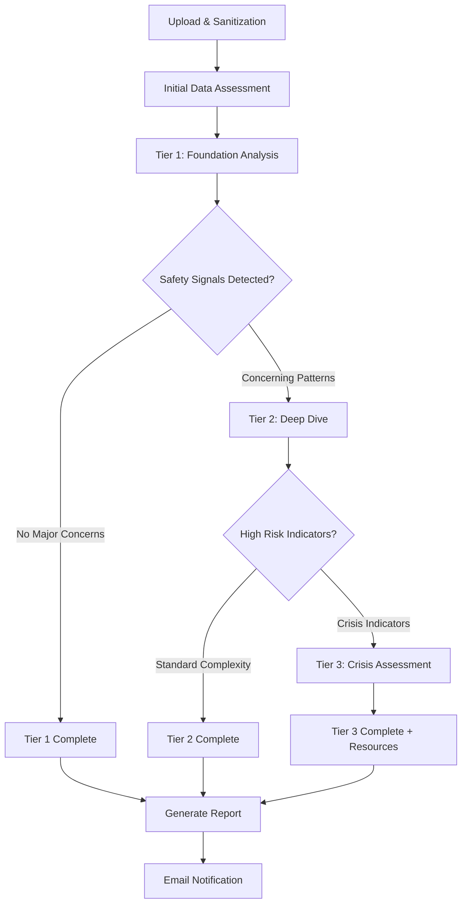

# AI Analysis Logic Tree - Technical Implementation

## Overview: Value-First Tiered Analysis

**Core Principle**: Every user gets the depth of analysis they need, regardless of cost. Tiers are about providing appropriate analysis depth, not cost savings.

## High-Level Analysis Flow



## Tier 1: Foundation Analysis (Everyone Gets This)

### 1.1 Data Quality & Context Assessment
```typescript
interface DataAssessment {
  conversationDepth: {
    totalMessages: number;
    averageLength: number;
    conversationDuration: string; // days/weeks
    platformDistribution: Record<Platform, number>;
  };

  conversationQuality: {
    hasSubstantiveExchanges: boolean;
    superficialOnly: boolean;
    mixedDepth: boolean;
  };

  analysisReliability: {
    sufficientData: boolean;
    confidenceLevel: number; // 0-1
    limitations: string[];
  };
}
```

### 1.2 Basic Safety Screening
```typescript
interface BasicSafetyScreen {
  // Rule-based + Light AI screening
  immediateRedFlags: {
    explicitThreats: boolean;
    financialRequests: boolean;
    isolationLanguage: boolean;
    rapiddIntensityEscalation: boolean;
  };

  // Pattern recognition
  communicationConcerns: {
    boundaryTesting: { detected: boolean; examples: string[] };
    inconsistentStories: { detected: boolean; examples: string[] };
    pressureForPersonalInfo: { detected: boolean; examples: string[] };
  };

  riskLevel: 'green' | 'yellow' | 'orange' | 'red';
  escalationRecommended: boolean;
}
```

### 1.3 Attachment Style Baseline
```typescript
interface AttachmentBaseline {
  // Observable behavioral patterns
  communicationStyle: {
    questionAsking: number; // How curious are they?
    responsiveness: number; // Do they engage meaningfully?
    boundaryRespect: number; // Do they respect "no"?
    emotionalAwareness: number; // Do they acknowledge feelings?
  };

  // Preliminary attachment indicators
  preliminaryStyle: 'secure' | 'anxious' | 'avoidant' | 'mixed' | 'unclear';
  confidence: number; // How sure are we?
  requiresDeepAnalysis: boolean; // Complex/mixed signals?
}
```

## Tier 2: Deep Dive Analysis (Triggered By Complexity/Concerns)

### Escalation Triggers (Value-Based, Not Cost-Based):
- **Safety Concerns**: Any yellow/orange/red flags from Tier 1
- **Complex Attachment Patterns**: Mixed or unclear signals requiring nuanced analysis
- **Substantial Data**: Rich conversations that warrant deeper insight
- **User Patterns**: Interesting communication dynamics worth exploring

### 2.1 Advanced Attachment Analysis
```typescript
interface DeepAttachmentAnalysis {
  // Sophisticated pattern recognition
  attachmentDynamics: {
    anxiousIndicators: {
      reassuranceSeeking: { frequency: number; examples: string[] };
      conflictAvoidance: { pattern: string; impact: string };
      intimacyFears: { detected: boolean; manifestations: string[] };
    };

    avoidantIndicators: {
      emotionalDistancing: { frequency: number; examples: string[] };
      vulnerabilityAvoidance: { pattern: string; examples: string[] };
      independenceEmphasis: { detected: boolean; context: string[] };
    };

    secureIndicators: {
      directCommunication: { frequency: number; examples: string[] };
      emotionalRegulation: { demonstrated: boolean; examples: string[] };
      conflictResolution: { approach: string; effectiveness: string };
    };
  };

  // Contextual analysis
  triggersAndResponses: {
    identifiedTriggers: string[];
    copingStrategies: string[];
    adaptationPatterns: string[];
  };

  // Growth insights
  strengthsInRelating: string[];
  developmentOpportunities: string[];
  personalizedRecommendations: string[];
}
```

### 2.2 Communication Pattern Deep Dive
```typescript
interface CommunicationDeepDive {
  authenticityAnalysis: {
    genuineMoments: { examples: string[]; characteristics: string[] };
    performativeMoments: { examples: string[]; patterns: string[] };
    authenticityTrend: 'increasing' | 'decreasing' | 'stable' | 'variable';
  };

  conversationDynamics: {
    initiationPatterns: { frequency: number; quality: string; examples: string[] };
    topicNavigation: { comfort: string[]; avoidance: string[]; style: string };
    conflictHandling: { approach: string; effectiveness: string; examples: string[] };
  };

  emotionalIntelligence: {
    empathyDemonstration: { frequency: number; examples: string[] };
    emotionalExpression: { comfort: string; range: string[]; authenticity: string };
    boundaryAwareness: { respect: number; setting: number; examples: string[] };
  };
}
```

### 2.3 Enhanced Safety Assessment
```typescript
interface EnhancedSafetyAssessment {
  manipulationTactics: {
    loveBomnbing: { detected: boolean; timeline: string[]; impact: string };
    gaslighting: { instances: string[]; patterns: string[]; severity: string };
    isolationAttempts: { detected: boolean; methods: string[]; progression: string };
    futureF faking: { detected: boolean; promises: string[]; timeline: string };
  };

  controlPatterns: {
    decisionInfluence: { detected: boolean; examples: string[]; escalation: boolean };
    timeControl: { detected: boolean; examples: string[]; intensity: string };
    socialInfluence: { detected: boolean; targets: string[]; methods: string[] };
  };

  emotionalSafety: {
    validationPatterns: { frequency: number; genuineness: string };
    criticismPatterns: { frequency: number; constructiveness: string; impact: string };
    supportDemonstration: { consistency: string; examples: string[] };
  };
}
```

## Tier 3: Crisis Assessment (Triggered By High-Risk Indicators)

### Escalation Triggers:
- **Severe Safety Concerns**: Clear manipulation, threats, coercive control
- **Escalating Dangerous Patterns**: Increasing intensity of concerning behavior
- **Complex Trauma Indicators**: Signs of ongoing emotional abuse
- **Immediate Risk Factors**: Anything suggesting current danger

### 3.1 Comprehensive Safety Analysis
```typescript
interface CrisisSafetyAnalysis {
  threatAssessment: {
    immediateRisk: { level: string; indicators: string[]; timeframe: string };
    escalationPattern: { detected: boolean; timeline: string[]; prediction: string };
    safetyPlanning: { urgency: string; recommendations: string[]; resources: string[] };
  };

  traumaInformedAnalysis: {
    traumaBondingIndicators: { detected: boolean; cycle: string[]; intensity: string };
    dissociationSigns: { detected: boolean; triggers: string[]; coping: string[] };
    hypervigilancePatterns: { detected: boolean; manifestations: string[] };
  };

  supportSystemAssessment: {
    isolationLevel: { current: string; increasing: boolean; methods: string[] };
    supportNetworkStrength: { assessment: string; gaps: string[] };
    resourceNeeds: { immediate: string[]; ongoing: string[]; professional: string[] };
  };
}
```

### 3.2 Professional Resource Integration
```typescript
interface ProfessionalResourceSystem {
  clinicalReview: {
    flaggedForExpertReview: boolean;
    urgencyLevel: 'standard' | 'priority' | 'emergency';
    reviewNotes: string[];
  };

  resourceRecommendations: {
    therapyTypes: { recommended: string[]; specializations: string[] };
    supportGroups: { local: string[]; online: string[]; crisis: string[] };
    safetyResources: { hotlines: string[]; shelters: string[]; legal: string[] };
  };

  followUpProtocol: {
    checkInSchedule: string;
    monitoringRecommended: boolean;
    escalationPlan: string[];
  };
}
```

## Analysis Orchestration Logic

### Master Analysis Controller
```typescript
interface AnalysisOrchestrator {
  async processComplete(conversations: SanitizedConversation[]): Promise<AnalysisReport> {
    // Everyone gets Tier 1
    const tier1 = await this.runTier1Analysis(conversations);

    // Escalate based on findings + data richness (not cost)
    const needsTier2 = this.shouldEscalateToTier2(tier1, conversations);
    if (!needsTier2) return this.generateReport([tier1]);

    const tier2 = await this.runTier2Analysis(conversations, tier1);

    // Escalate to crisis assessment if needed
    const needsTier3 = this.shouldEscalateToTier3(tier2, conversations);
    if (!needsTier3) return this.generateReport([tier1, tier2]);

    const tier3 = await this.runTier3Analysis(conversations, tier1, tier2);
    return this.generateReport([tier1, tier2, tier3]);
  }

  private shouldEscalateToTier2(tier1: Tier1Results, conversations: SanitizedConversation[]): boolean {
    return (
      tier1.riskLevel !== 'green' ||                    // Any safety concerns
      tier1.attachmentBaseline.requiresDeepAnalysis ||  // Complex patterns
      conversations.length > 50 ||                      // Rich dataset worth exploring
      tier1.analysisReliability.confidenceLevel < 0.7  // Need more sophisticated analysis
    );
  }

  private shouldEscalateToTier3(tier2: Tier2Results, conversations: SanitizedConversation[]): boolean {
    return (
      tier2.safetyAssessment.riskLevel === 'red' ||
      tier2.manipulationTactics.some(tactic => tactic.severity === 'severe') ||
      tier2.threatAssessment.immediateRisk.level === 'high'
    );
  }
}
```

## Analysis Result Storage

### Database Schema
```sql
-- Analysis results with full technical details
CREATE TABLE analysis_results (
  id UUID PRIMARY KEY,
  user_id UUID REFERENCES users(id),
  created_at TIMESTAMP WITH TIME ZONE DEFAULT NOW(),

  -- Tier progression
  tiers_completed INTEGER[], -- [1, 2, 3]
  escalation_reasons TEXT[],

  -- Raw AI responses (for improvement/debugging)
  tier1_raw_response JSONB,
  tier2_raw_response JSONB,
  tier3_raw_response JSONB,

  -- Processed insights
  attachment_analysis JSONB,
  safety_assessment JSONB,
  communication_patterns JSONB,
  growth_opportunities JSONB,

  -- Meta analysis
  confidence_scores JSONB,
  processing_metadata JSONB -- models used, tokens, costs, etc.
);
```

This logic tree ensures everyone gets the analysis depth they need while maintaining detailed technical tracking for continuous improvement. The system prioritizes value and safety over cost optimization.