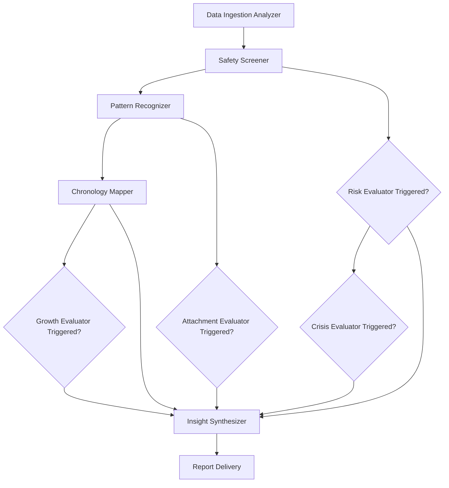

# Data Processor Terminology & Component Types

## Core Terminology

### **Analyzers** vs **Evaluators**
- **Analyzers**: Core processing components that always execute for every user
- **Evaluators**: Specialized processors that conditionally trigger based on analysis findings

### **Processing Phases**
- **Foundation Phase**: Data preparation and basic assessment
- **Analysis Phase**: Core pattern recognition and behavior analysis
- **Evaluation Phase**: Conditional deep-dive processing based on findings
- **Synthesis Phase**: Report generation and delivery

## Component Definitions

### **Analyzers** (Always Execute)

#### **Data Ingestion Analyzer**
- **Purpose**: Transform raw dating exports into normalized, analyzable data
- **Input**: Tinder JSON bundles, Hinge ZIP files, other platform exports
- **Output**: Unified conversation schema with sanitized content
- **Always runs**: Yes - fundamental data preparation

#### **Safety Screener**
- **Purpose**: Basic safety assessment and red flag detection
- **Input**: Normalized conversations
- **Output**: Risk level assessment + escalation flags
- **Always runs**: Yes - safety is always priority

#### **Pattern Recognizer**
- **Purpose**: Identify core communication and behavioral patterns
- **Input**: Normalized conversations + safety baseline
- **Output**: Communication style, attachment markers, authenticity patterns
- **Always runs**: Yes - provides foundation insights

#### **Chronology Mapper**
- **Purpose**: Time-based analysis and growth pattern detection
- **Input**: Patterns + conversation timestamps
- **Output**: Time-weighted insights and evolution tracking
- **Always runs**: Yes - temporal context essential

#### **Insight Synthesizer**
- **Purpose**: Combine all outputs into coherent user-facing insights
- **Input**: All analyzer and evaluator results
- **Output**: Structured report with prioritized insights
- **Always runs**: Yes - final step before delivery

### **Evaluators** (Conditionally Execute)

#### **Risk Evaluator**
- **Purpose**: Advanced safety analysis for concerning patterns
- **Trigger Conditions**:
  - Safety Screener detects yellow/orange/red flags
  - Pattern Recognizer identifies manipulation behaviors
  - Any coercion or control indicators present
- **Input**: Full conversation data + safety screening results
- **Output**: Detailed threat assessment + safety resources
- **AI Intensity**: High (GPT-4 with specialized safety prompts)

#### **Attachment Evaluator**
- **Purpose**: Nuanced attachment style analysis for complex cases
- **Trigger Conditions**:
  - Mixed or unclear attachment signals from Pattern Recognizer
  - Contradictory behavioral patterns across conversations
  - Rich dataset warrants deeper psychological analysis
- **Input**: Conversation patterns + behavioral markers
- **Output**: Sophisticated attachment analysis + personalized insights
- **AI Intensity**: High (GPT-4 with attachment theory expertise)

#### **Growth Evaluator**
- **Purpose**: Detailed personal development analysis for evolution cases
- **Trigger Conditions**:
  - Chronology Mapper detects significant growth patterns
  - Dataset spans 18+ months with development evidence
  - Strong positive evolution in communication or boundaries
- **Input**: Time-segmented patterns + evolution data
- **Output**: Detailed growth trajectory + development recommendations
- **AI Intensity**: Medium (GPT-4 Turbo for comprehensive analysis)

#### **Crisis Evaluator**
- **Purpose**: Comprehensive intervention for high-risk situations
- **Trigger Conditions**:
  - Risk Evaluator identifies severe safety concerns
  - Clear abuse, manipulation, or coercion patterns
  - Escalating dangerous behaviors detected
- **Input**: Complete data + all previous analysis
- **Output**: Crisis intervention plan + professional resources
- **AI Intensity**: Maximum (GPT-4 + expert safety prompts + potential human review)

## Processing Orchestration Logic

### **Sequential Dependencies**


### **Parallel Execution Where Possible**
- **Evaluators can run concurrently** once their trigger conditions are met
- **Risk Evaluator** and **Attachment Evaluator** can execute simultaneously
- **Growth Evaluator** waits for Chronology Mapper completion
- **Crisis Evaluator** waits for Risk Evaluator results

## Configuration & Flexibility

### **Trigger Threshold Configuration**
```typescript
interface ProcessorConfig {
  riskEvaluatorTriggers: {
    safetyLevel: 'yellow' | 'orange' | 'red';
    manipulationScore: number; // 0-1 threshold
    automaticEscalation: boolean;
  };

  attachmentEvaluatorTriggers: {
    mixedSignalThreshold: number; // 0-1, how unclear patterns must be
    dataRichnessMinimum: number; // minimum conversations for deep dive
    contradictionLevel: number; // conflicting pattern threshold
  };

  growthEvaluatorTriggers: {
    timeSpanMinimum: string; // "18_months"
    evolutionStrength: number; // how significant growth must be
    positiveTrajectoryRequired: boolean;
  };

  crisisEvaluatorTriggers: {
    riskLevel: 'orange' | 'red';
    severityThreshold: number;
    immediateInterventionRequired: boolean;
  };
}
```

### **Resource Management**
```typescript
interface ResourceAllocation {
  // Processing priority (1 = highest)
  processingPriority: {
    dataIngestion: 1;
    safetyScreener: 1;
    patternRecognizer: 2;
    chronologyMapper: 3;
    riskEvaluator: 1; // High priority for safety
    attachmentEvaluator: 4;
    growthEvaluator: 5;
    crisisEvaluator: 1; // Highest priority
    insightSynthesizer: 6;
  };

  // AI model allocation by component
  modelAssignment: {
    safetyScreener: "gpt-3.5-turbo";
    patternRecognizer: "gpt-4-turbo";
    riskEvaluator: "gpt-4";
    attachmentEvaluator: "gpt-4";
    growthEvaluator: "gpt-4-turbo";
    crisisEvaluator: "gpt-4"; // Best model for safety
  };
}
```

## Component Documentation Structure

Each processor component will have its own detailed documentation:

- **`analyzers/data-ingestion.md`** - File parsing, normalization, validation
- **`analyzers/safety-screener.md`** - Basic red flag detection logic
- **`analyzers/pattern-recognizer.md`** - Communication and behavior analysis
- **`analyzers/chronology-mapper.md`** - Time-based pattern evolution
- **`evaluators/risk-evaluator.md`** - Advanced safety assessment
- **`evaluators/attachment-evaluator.md`** - Deep attachment analysis
- **`evaluators/growth-evaluator.md`** - Personal development tracking
- **`evaluators/crisis-evaluator.md`** - Crisis intervention protocols

This terminology provides clear distinction between core processing (Analyzers) and specialized deep-dives (Evaluators), making the system easy to understand, debug, and enhance.